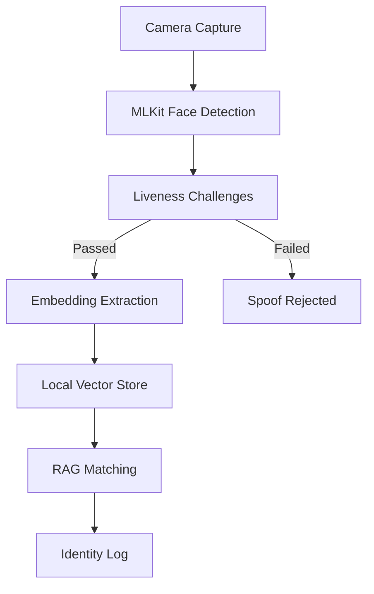

# NHAI Biometrics — Offline Face Recognition & Liveness Verification App

A high-performance, 100% offline, edge-AI biometric prototype built using **React Native**, **Expo**, **Google MLKit**, and **TensorFlow Lite (MobileFaceNet)**. Designed to operate completely offline on mobile devices for robust, privacy-preserving face recognition and liveness checks.

---

## 🧩 Face Recognition Pipeline Overview



---

### 🔎 Pipeline Stage Breakdown

| Stage                         | Description                                                                                  |
|-------------------------------|----------------------------------------------------------------------------------------------|
| **Camera Capture**            | Captures live video stream for real-time biometric analysis.                                 |
| **MLKit Face Detection**      | Detects and tracks up to 4 faces at once, overlays bounding boxes.                           |
| **Liveness Challenges**       | Sequential anti-spoofing tests: Blink, Smile, Turn Head, Look Up/Down, etc.                  |
| **Embedding Extraction**      | Generates face embeddings from MobileFaceNet (on device, offline).                           |
| **Local Vector Store Search** | Finds nearest matches among registered faces using an in-memory vector database.              |
| **RAG Matching**              | Contextual matching with consensus/margin filtering to reduce false positives.                |
| **Identity Logging**          | Logs successful and failed attempts securely in encrypted storage (MMKV).                     |

---

## 🚀 Key Features

- **Multi-Face Real-Time Detection & Identification:**
  - Live scan detects up to 4 faces simultaneously.
  - Real-time overlays and instant user feedback (registered = green, unknown = red).
- **Sequential Liveness Challenges:**
  - Supports Blink, Smile, Head Turn (left/right), Look Up/Down.
  - Visual/voice prompts (English & Hindi) to ensure user presence.
- **100% Offline Edge AI:**
  - Face embedding extraction via quantized MobileFaceNet (TFLite).
  - Ultra-fast facial attribute classification with Google MLKit.
- **Retrieval-Augmented Generation (RAG) Matching:**
  - Uses a local vector store for context-aware lookups.
  - Temporal consensus and high confidence threshold (0.93) for robust matching.
- **Secure Database:**
  - Encrypted, synchronous storage for templates and attendance logs.
  - Admin panel for face template management and log auditing.
- **Optimized Performance:**
  - Camera hardware powers down when not needed to maximize device battery and minimize CPU usage.

---

## 🛠️ Tech Stack

- **Framework:** React Native (Expo SDK 56)
- **Camera & Processing:** React Native Vision Camera (v4), Reanimated Worklets (JSI)
- **Face Detection:** Google MLKit (Face Detector)
- **AI Inference:** React Native Fast TFLite (MobileFaceNet)
- **Storage:** React Native MMKV (Encrypted, synchronous DB)

---

## ⚙️ Prerequisites

Before running the application, you’ll need:

1. **Node.js** (v18 or newer)
2. **Java Development Kit (JDK) 17** (required for native build)
3. **Android SDK & Platform Tools** (ensure `adb` runs in PATH)
4. A **Physical Android Device** with **USB debugging** enabled

---

## 🏃‍♂️ Getting Started

### 1. Install Dependencies
```bash
npm install
```

### 2. Configure JAVA_HOME (Windows)
```powershell
$env:JAVA_HOME="C:\Program Files\Eclipse Adoptium\jdk-17.0.18.8-hotspot"
```

### 3. Build & Run on Device
```powershell
$env:JAVA_HOME="C:\Program Files\Eclipse Adoptium\jdk-17.0.18.8-hotspot"; npm run android
```

### 4. Run Persistent ADB Tunnel (Optional)
```bash
node adb-tunnel.js
```

---

## 📂 Project Structure

```text
BiometricReactNative/
├── assets/                  # Quantized MobileFaceNet TFLite model & UI assets
├── src/
│   ├── screens/
│   │   ├── HomeScreen.tsx        # App entry dashboard
│   │   ├── EnrollScreen.tsx      # Multi-angle enrollment flow
│   │   ├── AuthScreen.tsx        # Verification with active liveness prompts
│   │   ├── LiveScanScreen.tsx    # Continuous multi-face CCTV scanning mode
│   │   └── DashboardScreen.tsx   # Admin panel for audit logs & face template deletion
│   ├── ModelLoader.ts            # TFLite model loader
│   ├── StorageEngine.ts          # MMKV storage interface
│   ├── VectorStore.ts            # In-memory vector store & search
│   ├── RAGPipeline.ts            # Match engine & consensus manager
│   ├── NativeFaceRecognition.ts  # L2 normalization & cosine similarity metrics
│   ├── LivenessEngine.ts         # MLKit facial attribute threshold checkers
│   └── QualityGate.ts            # Pose and size quality checkers
├── adb-tunnel.js            # Persistent adb reverse TCP tunnel utility
├── package.json
└── tsconfig.json
```

---

## 📝 Contributing

Contributions welcome! Open issues, suggest features, or submit PRs for improvements.

---

## 📄 License

[MIT License](LICENSE)

---

## 🙏 Acknowledgements

- [face-api.js](https://github.com/justadudewhohacks/face-api.js)
- [LangChain](https://github.com/langchain-ai/langchain-js) or [Haystack](https://github.com/deepset-ai/haystack) (if used)
- All open-source contributors!

---
